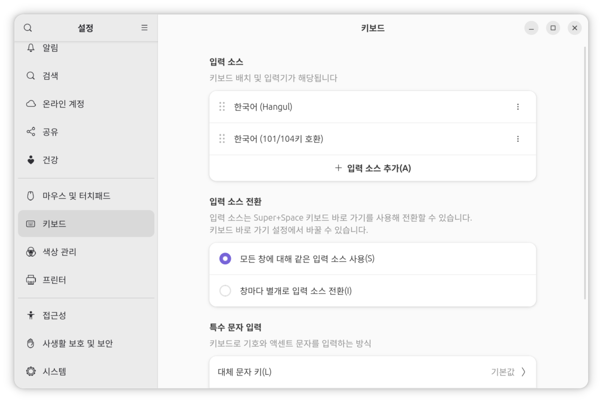
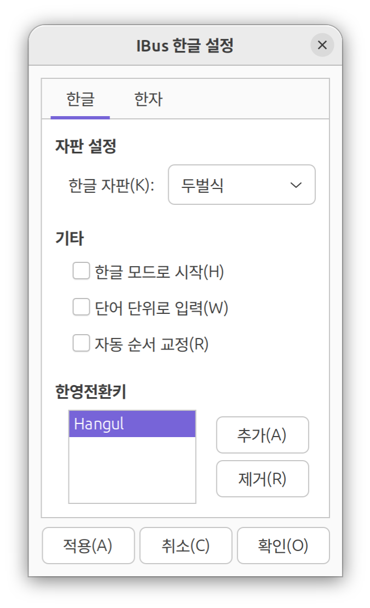
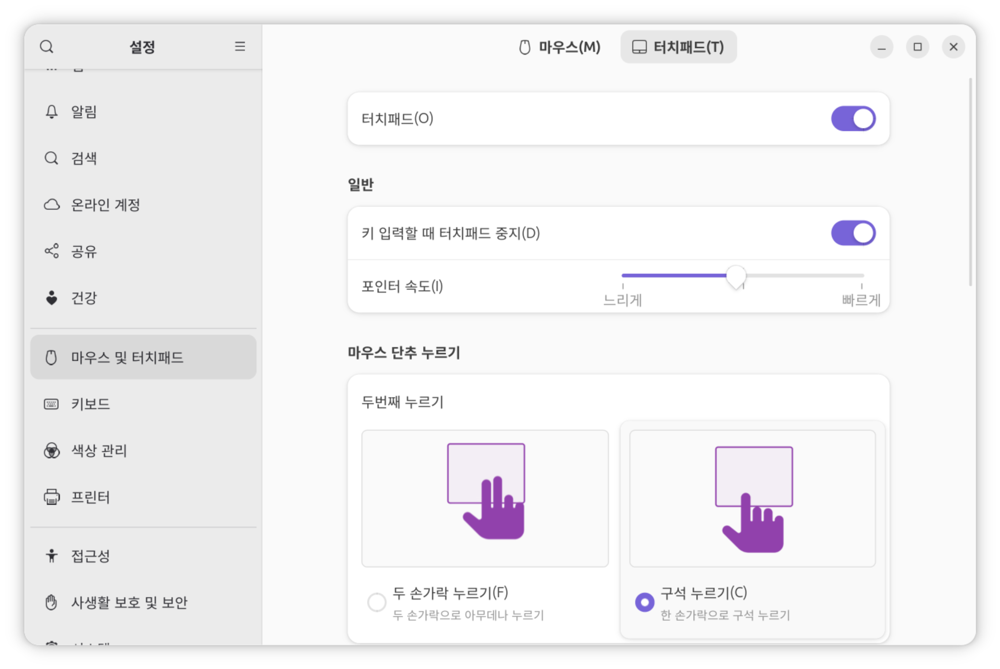

## 리눅스를 설치하게 된 계기

평소 보안 공부와 개발을 윈도우 native 환경이 아닌, WSL2를 이용해 리눅스 환경에서 해왔다. 그런데 WSL2, Docker, 브라우저, IDE를 열기만 해도 10GB를 기본적으로 사용했다. 여기서 브라우저 탭을 늘리거나, WSL2에서 무거운 작업을 하면 금방 16GB를 가득 채우게 되며 속도가 매우 느려졌다. (참고로 필자의 노트북의 메모리는 16GB다.)

그래서 차라리 WSL2를 버리고 윈도우에서 작업을 할까 했지만, 리눅스가 주는 편안함을 포기할 수 없었기 때문에 리눅스랑 친해질 겸 윈도우를 밀고 리눅스를 설치하게 되었다.

## 리눅스 배포판 정하기

지금까지 써본 리눅스라고는 홈서버에서 사용하는 우분투와 데비안밖에 없었다.  
지금까지 데비안 계열만 사용해왔기 때문에 Fedora를 사용해볼까 했지만, 리눅스 데스크톱에 익숙하지 않은데 써보지도 않은 배포판을 사용하는 것은 시기상조인 것 같아서, 우분투를 사용하기로 했다.

## 우분투 26.04

우분투 26.04는 **Resolute Raccoon**이라는 코드네임을 갖고 출시했다. 
GNOME 50을 기본적으로 탑재하고, `sudo-rs`를 사용하는 배포판이다.

:::tip[Ubuntu 뒤에 오는 숫자는 무엇을 의미할까?]
해당 버전이 릴리즈된 연월을 말한다. 예를 들자면, 26년 4월에 출시된 우분투는 26.04가 뒤에 붙는다.   
그리고 Ubuntu는 6개월마다 새로운 버전을 릴리즈 하는데, 짝수년 4월에는 장기 지원 버전을, 이외에는 모두 단기 지원 버전을 출시한다. 
:::

## 우분투 설치하기

Rufus로 이미지를 USB로 굽고 부팅하고, Next 버튼을 계속 누르다 보면 한국어가 입력되지 않고, 트랙패드 스크롤 속도가 엄청 빠른 우분투가 깔려있다...!

### 한국어 입력 문제 해결하기

이 문제는 생각보다 가볍게 해결할 수 있었는데 아래 사진과 같이 입력 소스에 `한국어 (Hangul)`, `한국어(101/104키 호환)`이 되도록 추가를 해주고

`한국어(Hangul)`에 들어가서 한/영 전환 키를 원하는 키로 변경해주면 된다.

:::note
필자의 경우 윈도우에서 쓰던 `한/영` 키를 입력하면 `Hangul`이 아닌 `R_Alt`로 뜨는 일이 발생했다. 열심히 삽질을 하다가 `/usr/share/X11/xkb/keycodes/evdev`에서 `한/영`키가 `R_Alt`로 매핑되어 있어서 `HNGL`로 바꿔주니 위 사진처럼 `Hangul`로 잘 떴다.
:::

### 엄청 빠른 스크롤 속도 해결하기

3일 동안 삽질을 하게 만든 머리 아픈 문제였다.

아래 사진과 같이 GNOME에서 `포인터 속도` 옵션은 제공해주지만 `스크롤 속도` 옵션은 제공해주지 않는다. (글을 쓰는 시점에서 찾아보니 `스크롤 속도` 옵션을 추가하는 [PR](https://gitlab.gnome.org/GNOME/mutter/-/merge_requests/4952)이 열려있다.)

해결하기 위해서 여러 방법을 시도해보았지만, 유일하게 효과가 있던 방법은 [libinput-config](https://gitlab.com/warningnonpotablewater/libinput-config)를 사용하는 것이었다.

[libinput-config](https://gitlab.com/warningnonpotablewater/libinput-config)를 클론하고 설치한 뒤, `/etc/libinput.conf`에서 `scroll-factor`를 `0.3` 정도로 설정하니 원하는 속도로 잘 동작하였다.

## 사용 후기

이 글을 쓰고 있는 시점으로 우분투를 깐 지 한 달이 다 되어간다. 필자의 사용 패턴에서는 크게 불편한 점이 없고 오히려 윈도우보다 사용하기 편했으며, 메모리도 적게 먹어서 만족했다. 무엇보다 리눅스 명령어를 WSL2를 사용하지 않고 바로 실행할 수 있던 게 좋았다.  
하지만, 카카오톡이 공식적으로 지원되지 않아서 `wine`을 통해서 설치해야 한다는 게 불편하긴 하다.

윈도우에서만 돌아가는 프로그램이 꼭 필요한 게 아니라면 리눅스를 한 번쯤 써보는 것도 좋은 경험이라고 생각한다.

트러블 슈팅할때 스크린샷을 찍지 않아서 내용이 부실한점 양해바랍니다 ㅜㅜ